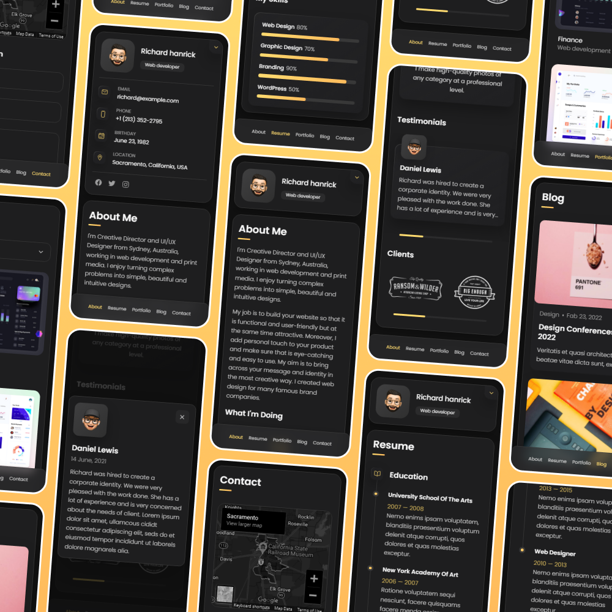

# vCard - Personal portfolio

vCard is a fully responsive personal portfolio website, responsive for all devices, built using HTML, CSS, and JavaScript.

## Demo

## Prerequisites

Before you begin, ensure you have met the following requirements:

* [Git](https://git-scm.com/downloads "Download Git") must be installed on your operating system.

## Installing vCard

To install, follow these steps:

Linux and macOS:

## License

This project is **free to use** and does not contains any license.
